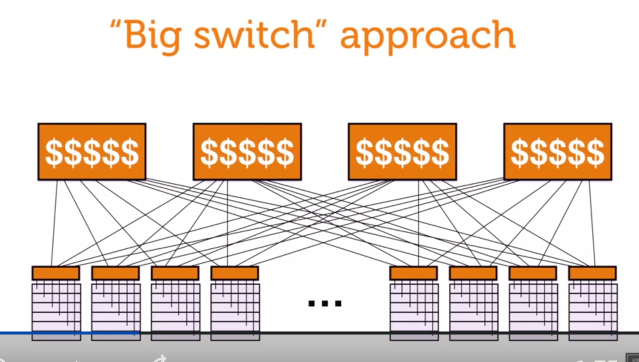
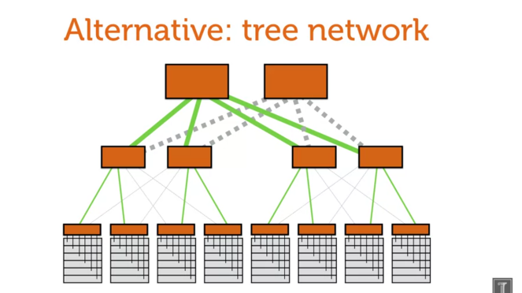
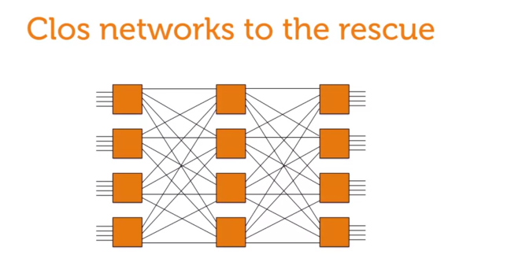
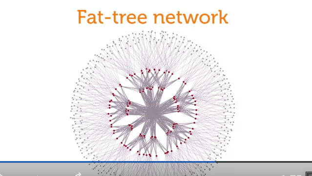

# Physical Network Infrastructure in Cloud Data Centers

## Overview
- **Scale of Modern Data Centers**:
  - Comparable in size to large facilities like shopping malls.
  - Example: Facebook's data center in Prineville, Oregon, with specific planning for:
    - Temperature and humidity control.
    - Power infrastructure.

- **Server Organization**:
  - Servers are arranged into racks/cabinets on the data center floor.
  - **Top-of-Rack (ToR) Switches**:
    - Connect servers in the same rack.
    - Provide full line-rate communication between ports.
  - Racks are interconnected through the network for collaborative computation.

## Network Challenges and Requirements
- **Traffic Trends**:
  - Internal machine-to-machine traffic in data centers grows rapidly.
  - Example: Facebook observes internal traffic doubling every year.

- **Network Design Goals**:
  - High capacity to avoid bottlenecks.
  - Scalability to support increasing servers.
  - Flexibility and cost efficiency.

## Network Design Approaches
### 1. **Big Switch Approach**
   - **Description**: A single large switch connects all racks.
   - **Example**: Google’s 2004 deployment of 500 racks, each with 40 servers.
   - **Challenges**:
     - High congestion due to limited uplink capacity (e.g., 40 Gbps rack bandwidth vs. 4 Gbps uplink).
     - High cost of large, proprietary switches.
     - Poor scalability and difficult upgrades (e.g., moving to 10 Gbps ports).
     - Limited fault tolerance and flexibility.

### 2. **Tree Topology**
   - **Description**: Hierarchical organization with multiple switch layers.
   - **Advantages**:
     - Scalable to some extent.
     - Redundancy helps mitigate failures.
   - **Challenges**:
     - Congestion at the root of the network with increasing traffic.
     - Poor fault recovery.
     - Expensive high-capacity switches still required at the top.

### 3. **Clos/Fat-Tree Topology**
   - **Description**: Inspired by the 1950s Clos network for telephone systems, adapted as a folded fat-tree for data centers.
   - **Key Features**:
     - Built using small, low-cost switches.
     - Redundant paths ensure resilience and load balancing.
     - Example: A 3-layer fat-tree can scale to over 200,000 servers using 96-port switches.
   - **Advantages**:
     - Full bisection bandwidth with redundancy.
     - Flexibility to scale by adding layers or increasing switch port counts.
     - Reduced cost compared to big switches.
   - **Challenges**:
     - Requires careful cable management due to high interconnectivity.
     - Long optical cables with transceivers add cost for distant connections.

### 4. **Alternative Topologies**
   - **3D Torus**:
     - Nodes connect only to close neighbors.
     - Suited for applications like climate simulations with local communication patterns.
   - **Hypercube**:
     - Highly interconnected topology for specific high-performance applications.

## Practical Considerations
- **Cable Management**:
  - Aggregating cables simplifies physical layout but doesn't change topology or capacity.
  - Optical cables are necessary for long distances but are costlier than copper.

- **External Connectivity**:
  - Integration with external networks via BGP routers and larger switches.

## Real-World Deployments
- Major companies (e.g., Google, Microsoft, Facebook) have converged on Clos/Fat-tree designs for their scalability and efficiency.
- Custom topologies like the 3D torus or hypercube are used for specific use cases, such as simulations.

## Key Takeaways
- **Scalability and Capacity**: Fat-tree and Clos topologies dominate modern cloud data centers for their ability to scale while maintaining high bandwidth.
- **Traffic-Aware Design**: The choice of topology should align with the traffic patterns of the target applications.
- **Routing and Topology Interplay**: Effective routing complements the topology, ensuring optimal traffic flow and fault recovery.

---

### GPT:
- **Additional Notes**:
  - Fat-tree topologies support load balancing via Equal-Cost Multi-Path (ECMP) routing.
  - Cable bundling can improve manageability but needs careful planning to avoid operational issues.
  - Alternatives like the 3D torus are excellent for applications with spatial locality but unsuitable for traffic-heavy workloads like MapReduce.
